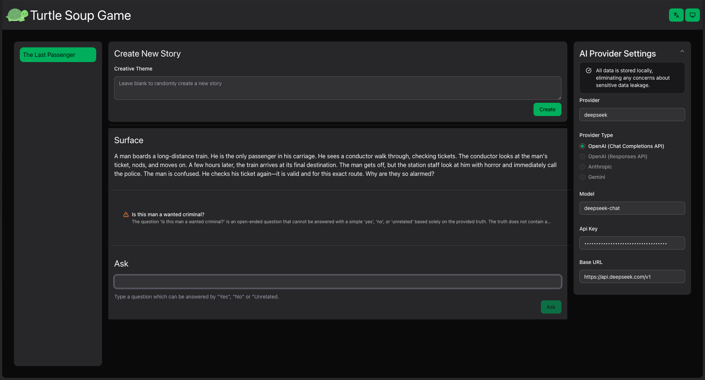

# 🐢 Turtle Soup Game

An AI-powered interactive Turtle Soup lateral thinking puzzle game with multilingual support and offline capabilities.

English | [简体中文](docs/README.zh-CN.md)



## ✨ Features

- 🤖 **AI-Powered**: Generate puzzles and intelligently evaluate player questions using AI
- 🌍 **Internationalization**: Support for both Simplified Chinese and English
- 🎨 **Modern UI**: Beautiful interface built with Tailwind CSS v4 and Radix UI
- 💾 **Offline-First**: Local storage using IndexedDB for offline gameplay
- 🎭 **Theme Switching**: Support for light and dark modes
- ⚡ **Performance Optimized**: Blazing fast development and production experience with React 19 + Vite
- 🔒 **Type-Safe**: Complete TypeScript support with Zod runtime validation

## 🎮 What is Turtle Soup?

Turtle Soup (Lateral Thinking Puzzle) is a deductive reasoning game. The puzzle master presents a seemingly unreasonable event (the "surface"), and players must deduce the complete story truth (the "truth") through questioning. The puzzle master can only answer "yes", "no", or "irrelevant".

## 🛠️ Tech Stack

- **Frontend Framework**: React 19
- **Build Tool**: Vite (Rolldown)
- **Language**: TypeScript 5.9
- **Styling**: Tailwind CSS v4
- **UI Components**: Radix UI
- **Database**: Dexie (IndexedDB wrapper)
- **AI Integration**: Vercel AI SDK
- **Data Fetching**: SWR
- **Internationalization**: i18next + react-i18next
- **Forms**: TanStack Form
- **Animation**: Motion
- **Linting**: ESLint + Biome

## 📦 Installation

This project uses pnpm as the package manager. Please install pnpm first if you haven't:

```bash
# Install pnpm globally
npm install -g pnpm

# Install dependencies
pnpm install
```

## 🚀 Development

```bash
# Start development server
pnpm dev

# Build for production
pnpm build

# Preview production build
pnpm preview

# Lint code
pnpm lint

# Auto-fix linting issues
pnpm lint:fix

# Format code
pnpm format
```

## 🌐 Internationalization

```bash
# Extract translation keys
pnpm i18n:extract

# Check translation status
pnpm i18n:status
```

## 🏗️ Project Structure

```
src/
├── ai/              # AI integration logic
│   └── game.ts      # AI functions for puzzle generation and question evaluation
├── components/      # Reusable components
│   └── ui/          # Base UI components (built on Radix UI)
├── config/          # Configuration files
│   ├── ai.ts        # AI prompt configurations
│   └── swr.ts       # SWR key configurations
├── db/              # Database module
│   ├── database.ts  # Dexie database instance (private)
│   ├── operations.ts # Database operation API (public)
│   └── index.ts     # Public entry point
├── pages/           # Page components
│   ├── home-page/   # Home page
│   └── turtle-page/ # Game page
├── types/           # TypeScript type definitions
│   ├── ai.ts        # AI-related types
│   ├── game.ts      # Game data types and Zod schemas
│   └── index.ts     # Type exports
└── utils/           # Utility functions
```

## 💾 Database Design

The project uses Dexie (IndexedDB) for local data storage with a relational design:

### Tables

**soups table** (Puzzles)
- `id`: Unique identifier
- `title`: Puzzle title
- `surface`: The puzzle surface (the mystery)
- `truth`: The puzzle truth (the solution)
- `createAt`: Creation timestamp
- `updateAt`: Update timestamp

**tries table** (Attempt records)
- `id`: Unique identifier
- `soupId`: Associated puzzle ID (foreign key, indexed)
- `question`: Player's question
- `status`: Question status ("valid" | "invalid")
- `response`: AI's answer ("yes" | "no" | "unrelated"), only valid for valid status
- `reason`: Evaluation reasoning
- `createAt`: Creation timestamp
- `updateAt`: Update timestamp

### Database API

All database operations are performed through functions provided by the `@/db` module. Direct access to the database instance is blocked by ESLint:

```typescript
import { createSoup, getSoupById, addTryToSoup } from '@/db';

// ✅ Correct: Use operation functions
const soup = await getSoupById(soupId);
await addTryToSoup(soupId, tryRecord);

// ❌ Wrong: Direct database instance import triggers ESLint error
import db from '@/db/database';
```

Key features:
- **Transaction Safety**: All relational operations are wrapped in transactions to ensure atomicity
- **Type Safety**: Runtime validation using Zod schemas
- **Foreign Key Relations**: tries table links to soups table via `soupId` field
- **Cascade Deletion**: Deleting a puzzle automatically removes associated attempt records

For detailed documentation, see [src/db/README.md](src/db/README.md)

## 🤖 AI Configuration

The project supports multiple AI providers (OpenAI, Anthropic, Google Gemini, etc.) through a unified Vercel AI SDK interface:

1. Configure AI provider information in settings (API Key, Base URL, Model, etc.)
2. AI can generate new Turtle Soup puzzles
3. AI intelligently evaluates player questions and returns "yes", "no", or "irrelevant"

## 🎨 Theme System

Uses OKLCH color space for a consistent theme system with light and dark mode support:

- **Primary**: Turtle Green
- **Secondary**: Secondary background color
- **Tertiary**: Tertiary background color
- **Semantic Colors**: Warning (orange), Info (blue), Success (green)

All colors include hover states and automatically adjust in dark mode.

## 📝 Development Guidelines

### Database Operations

1. **Import only from `@/db`**: Do not directly access `@/db/database`
2. **Use relational operations**: Use `addTryToSoup` instead of `createTry`
3. **Rely on transactions**: Multi-table operations are handled internally with transactions
4. **Type validation**: All operations perform Zod runtime validation

### Code Style

- Use Biome and ESLint for code linting
- Run `pnpm lint:fix` and `pnpm format` before committing
- Follow TypeScript strict mode
- Use functional component style and prefer hooks

## 🤝 Contributing

Issues and Pull Requests are welcome!

## 📄 License

This project is licensed under the GNU General Public License v3.0 (GPLv3).

See the [LICENSE](LICENSE) file for details.

---

**Enjoy the game! 🎉**
