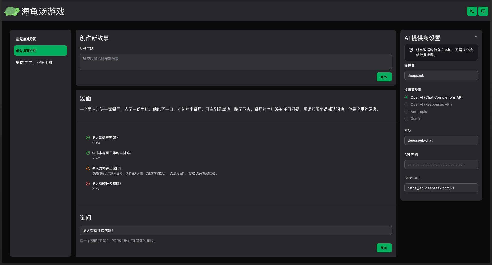

# 🐢 海龟汤游戏 (Turtle Soup Game)

一个基于 AI 的互动式海龟汤推理游戏，支持多语言和离线游戏。

[English](../README.md) | 简体中文



## ✨ 特性

- 🤖 **AI 驱动**: 使用 AI 生成谜题并智能判断玩家的提问
- 🌍 **国际化**: 支持简体中文和英文两种语言
- 🎨 **现代化 UI**: 基于 Tailwind CSS v4 和 Radix UI 的精美界面
- 💾 **离线优先**: 使用 IndexedDB 本地存储，支持离线游玩
- 🎭 **主题切换**: 支持亮色/暗色主题
- ⚡ **性能优化**: React 19 + Vite 提供极速的开发和生产体验
- 🔒 **类型安全**: 完整的 TypeScript 支持和 Zod 运行时验证

## 🎮 什么是海龟汤？

海龟汤（Lateral Thinking Puzzle）是一种推理解谜游戏。出题者给出一个看似不合理的事件（汤面），玩家需要通过提问来推理出完整的故事真相（汤底）。出题者只能回答"是"、"否"或"无关"。

## 🛠️ 技术栈

- **前端框架**: React 19
- **开发工具**: Vite (Rolldown)
- **语言**: TypeScript 5.9
- **样式**: Tailwind CSS v4
- **UI 组件**: Radix UI
- **数据库**: Dexie (IndexedDB wrapper)
- **AI 集成**: Vercel AI SDK
- **数据获取**: SWR
- **国际化**: i18next + react-i18next
- **表单**: TanStack Form
- **动画**: Motion
- **代码检查**: ESLint + Biome

## 📦 安装

```bash
# 使用 pnpm (推荐)
pnpm install

# 或使用 npm
npm install

# 或使用 yarn
yarn install
```

## 🚀 开发

```bash
# 启动开发服务器
pnpm dev

# 构建生产版本
pnpm build

# 预览生产构建
pnpm preview

# 代码检查
pnpm lint

# 自动修复代码问题
pnpm lint:fix

# 格式化代码
pnpm format
```

## 🌐 国际化

```bash
# 提取翻译键
pnpm i18n:extract

# 查看翻译状态
pnpm i18n:status
```

## 🏗️ 项目结构

```
src/
├── ai/              # AI 集成逻辑
│   └── game.ts      # 生成谜题和判断提问的 AI 函数
├── components/      # 可复用组件
│   └── ui/          # UI 基础组件 (基于 Radix UI)
├── config/          # 配置文件
│   ├── ai.ts        # AI 提示词配置
│   └── swr.ts       # SWR 键配置
├── db/              # 数据库模块
│   ├── database.ts  # Dexie 数据库实例 (私有)
│   ├── operations.ts # 数据库操作 API (公开)
│   └── index.ts     # 公共入口
├── pages/           # 页面组件
│   ├── home-page/   # 主页
│   └── turtle-page/ # 游戏页面
├── types/           # TypeScript 类型定义
│   ├── ai.ts        # AI 相关类型
│   ├── game.ts      # 游戏数据类型和 Zod Schema
│   └── index.ts     # 类型导出
└── utils/           # 工具函数
```

## 💾 数据库设计

项目使用 Dexie (IndexedDB) 进行本地数据存储，采用关系型设计：

### 数据表

**soups 表** (谜题)
- `id`: 唯一标识符
- `title`: 谜题标题
- `surface`: 汤面（谜面）
- `truth`: 汤底（真相）
- `createAt`: 创建时间
- `updateAt`: 更新时间

**tries 表** (尝试记录)
- `id`: 唯一标识符
- `soupId`: 关联的谜题 ID (外键，已索引)
- `question`: 玩家的提问
- `status`: 提问状态 ("valid" | "invalid")
- `response`: AI 的回答 ("yes" | "no" | "unrelated")，仅 valid 状态有效
- `reason`: 判断理由
- `createAt`: 创建时间
- `updateAt`: 更新时间

### 数据库 API

所有数据库操作都通过 `@/db` 模块提供的函数进行，直接访问数据库实例会被 ESLint 阻止：

```typescript
import { createSoup, getSoupById, addTryToSoup } from '@/db';

// ✅ 正确：使用操作函数
const soup = await getSoupById(soupId);
await addTryToSoup(soupId, tryRecord);

// ❌ 错误：直接导入数据库实例会触发 ESLint 错误
import db from '@/db/database';
```

关键特性：
- **事务安全**: 所有关联操作都包装在事务中，确保原子性
- **类型安全**: 使用 Zod Schema 进行运行时验证
- **外键关系**: tries 表通过 `soupId` 字段关联到 soups 表
- **级联删除**: 删除谜题时自动删除相关的尝试记录

详细文档请查看 [src/db/README.md](../src/db/README.md)

## 🤖 AI 配置

项目支持多种 AI 提供商（OpenAI、Anthropic、Google Gemini 等），通过 Vercel AI SDK 统一接口：

1. 在设置中配置 AI 提供商信息（API Key、Base URL、模型等）
2. AI 可以生成新的海龟汤谜题
3. AI 会智能判断玩家的提问，返回"是"、"否"或"无关"

## 🎨 主题系统

使用 OKLCH 色彩空间实现一致的主题系统，支持亮色/暗色模式：

- **Primary**: 海龟绿 (Turtle Green)
- **Secondary**: 次要背景色
- **Tertiary**: 第三级背景色
- **语义色**: Warning (橘黄)、Info (蓝色)、Success (绿色)

所有颜色都包含 hover 状态，并在暗色模式下自动调整。

## 📝 开发规范

### 数据库操作

1. **仅通过 `@/db` 导入**: 不要直接访问 `@/db/database`
2. **使用关系操作**: 使用 `addTryToSoup` 而不是 `createTry`
3. **依赖事务**: 涉及多表操作时，函数内部已处理事务
4. **类型验证**: 所有操作都会进行 Zod 运行时验证

### 代码风格

- 使用 Biome 和 ESLint 进行代码检查
- 提交前运行 `pnpm lint:fix` 和 `pnpm format`
- 遵循 TypeScript 严格模式
- 组件使用函数式风格，优先使用 hooks

## 🤝 贡献

欢迎提交 Issue 和 Pull Request！

## 📄 许可

本项目采用 GNU General Public License v3.0 (GPLv3) 协议开源。

详见 [LICENSE](../LICENSE) 文件。

---

**Enjoy the game! 🎉**
